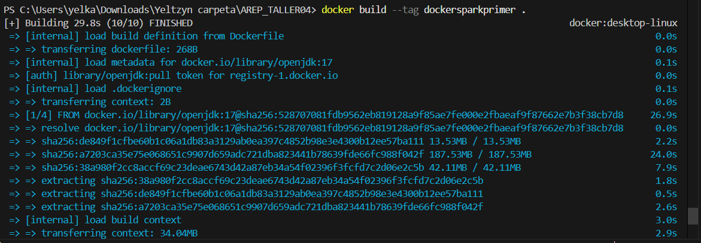

# AREP-Lab4
# Taller sobre modularización con virtualización e Introducción a Docker

## Resumen

El taller consiste en crear una pequeña aplicación web utilizando **Spring**. Una vez que tengamos esta aplicación, procederemos a construir un contenedor Docker para la aplicación y desplegarla y configurarla en nuestra máquina local. Luego, crearemos un repositorio en **DockerHub** y subiremos la imagen al repositorio. Finalmente, crearemos una máquina virtual en **AWS**, instalaremos Docker y desplegaremos el contenedor que acabamos de crear.

## Empezando

Estas instrucciones te guiarán para obtener una copia del proyecto y ejecutarlo en tu máquina local para fines de desarrollo y pruebas.

### Prerrequisitos

Para ejecutar este proyecto, debes tener Java instalado en tu sistema. Sigue los pasos a continuación para instalar Java y Maven (que se utiliza para gestionar las dependencias).

1. **Instalar Java:**
   - Descarga e instala el JDK de Java (versión 11 o superior). Puedes seguir las instrucciones en el [sitio web oficial de Java](https://www.oracle.com/java/technologies/javase-jdk11-downloads.html).

2. **Instalar Maven:**
   - Maven se utiliza para gestionar las dependencias del proyecto. Puedes descargar e instalar Maven desde [aquí](https://maven.apache.org/download.cgi).
   - Después de la instalación, verifica si Maven está correctamente instalado ejecutando:
     ```bash
     mvn -v
     ```
     Esto debería mostrar la versión instalada de Maven.

3. **Instalar Docker:**
   - Descarga e instala Docker desde [aquí](https://www.docker.com/products/docker-desktop).

### Instalación

> [!NOTA]
> Debes realizar los siguientes pasos desde una terminal Bash o PowerShell en Windows.

> [!IMPORTANTE]
> Asegúrate de que Docker Desktop esté en ejecución antes de continuar.

Para configurar tu entorno de desarrollo:

1. **Clona el repositorio:**
   ```bash
   git clone https://github.com/YeltzynS/AREP_TALLER04.git
```
2. **Navega al directorio del proyecto:**
```bash
cd AREP_TALLER04
```
3. **Compila el proyecto con Maven:**
```bash
mvn clean install
```


.

### Servidor de Archivos Estáticos
- Sirve HTML, CSS, JS, imágenes y más desde un directorio configurable (staticFilesLocation).
- Soporta múltiples tipos de contenido (text/html, application/javascript, image/png, etc.).

###  Despliegue en AWS EC2
- Configurado para desplegarse en instancias EC2.
- Reglas del grupo de seguridad habilitadas para permitir el acceso a través del puerto 42000.


### Project Structure
```Bash
AREP-TALLER04/
│── src/
│   ├── main/
│   │   ├── java/
│   │   │   ├── com/edu/eci/arep/Annotation/
│   │   │   │   ├── GetMapping.java
│   │   │   │   ├── PostMapping.java
│   │   │   │   ├── RequestBody.java
│   │   │   │   ├── RequestParam.java
│   │   │   │   ├── RestController.java
│   │   │   ├── com/edu/eci/arep/Controller/
│   │   │   │   ├── GreetingController.java
│   │   │   │   ├── WorkoutController.java
│   │   │   ├── com/edu/eci/arep/Server/
│   │   │   │   ├── HttpServer.java
│   │   │   │   ├── Request.java
│   │   │   │   ├── Response.java
│   │   │   │   ├── WorkoutPlanner.java
│   │   │   ├── SpringApplication.java
│   ├── resources/
│   │   ├── img
│   │   ├── static
│   │   │   │── fondo.jpg
│   │   │   │── style.css
│   │   │   │── script.js
│   │   │   ├── index.html
│── pom.xml
│── README.md
│── Dockerfile
│── docker-compose.yml
```


## Concurrencia

```Java
public class HttpServer {

    private static final String STATIC_FOLDER = "src/main/resources/static";
    private static final Map<String, BiFunction<Request, Response, String>> routes = new HashMap<>();
    private static final Map<String, BiFunction<Request, Response, String>> postRoutes = new HashMap<>();
    private static ServerSocket serverSocket;

    public static void start(int port) throws IOException {
        serverSocket = new ServerSocket(port);
        System.out.println("Servidor iniciado en el puerto " + port + "...");

        
        registerControllers();

        while (true) {
            Socket clientSocket = serverSocket.accept();
            
            new Thread(() -> {
                try {
                    handleRequest(clientSocket);
                } catch (Exception e) {
                    System.err.println("Error al manejar la solicitud: " + e.getMessage());
                } finally {
                    try {
                        clientSocket.close();
                    } catch (IOException e) {
                        System.err.println("Error al cerrar la conexión: " + e.getMessage());
                    }
                }
            }).start();
        }
    }
```


## Docker
- Configure the Dockerfile:
```CMD
FROM openjdk:17

WORKDIR /usrapp/bin

ENV PORT 35000

COPY /target/classes /usrapp/bin/classes
COPY /target/dependency /usrapp/bin/dependency

CMD ["java","-cp","./classes:./dependency/*","com.edu.eci.arep.SpringApplication"]
```
- Crea la imagen de Docker:
  



- Ejecuta el contenedor de Docker:
  


- Accede a la aplicación en el navegador:
  


- Upload to docker hub
  


## DockerHub

- Creación del repositorio

- Sube la imagen a DockerHub:


## AWS
1. Accede a la máquina virtual:


2. Instalar Docker


3. Ejecuta el contenedor de Docker:


4. Abre el puerto 42000 en el grupo de seguridad:


5. Accede a la aplicación


## Videos 
[Ver video](src/main/resources/videos/awsvideo.mp4)
[Ver video](src/main/resources/videos/awsvideo2.mp4)
[Ver video](src/main/resources/videos/awsvideo3.mp4)

### Running the Tests
Se incluyen pruebas automatizadas para garantizar la funcionalidad del servidor y la aplicación web.

> Debes probar en una terminal Bash o PowerShell diferente en Windows.
1. **Ejecutar pruebas unitarias:**
   ```bash
   mvn test
   ```
   Esto ejecutará todas las pruebas unitarias y mostrará los resultados en la terminal.

## Test
### Unit Test


### Construido Con
Java: El lenguaje de programación utilizado.

Maven: Herramienta de gestión de dependencias y construcción.

JUnit: Framework de pruebas.

Mockito: Framework de simulación para pruebas unitarias.

Docker: Herramienta de contenedorización.

### Author
- Yeltzyn Sierra
  
### License
This project is licensed under the MIT license: see the LICENSE.md file for details.


