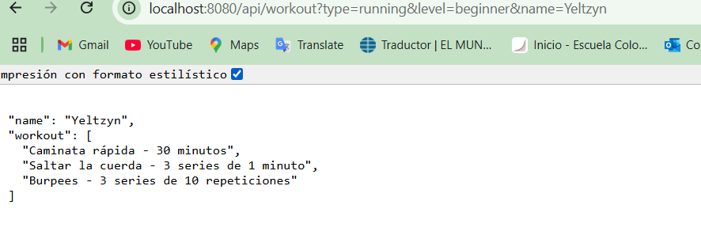

# Arquitecturas de Servidores de Aplicaciones, Meta protocolos de objetos, Patrón IoC, Reflexión

Este proyecto es un servidor HTTP que permite a los usuarios obtener rutinas de entrenamiento dinámicas basadas en tipo (fuerza, cardio, flexibilidad) y nivel (principiante, intermedio, avanzado). También permite servir archivos estáticos como HTML, CSS y JavaScript.

## Estructura del proyecto

```
├── src/
│   ├── main
│   │   ├── java/com/eci/arep/httpserver
│   │   │   ├── HttpServer.java         
│   │   │   ├── WorkoutPlanner.java
|   |   |   |--Request.java
|   |   |   |--Response.java 
│   │   ├── resources/
│   │   │   ├── img
│   │   │   │   ├── pagina.png             
│   │   │   │   ├── Pruebas.png
│   │   │   │   ├── resultado.png                           
│   │   │   ├── static
│   │   │   │   ├── index.html           
│   │   │   │   ├── style.css            
│   │   │   │   ├── script.js            
│   │   │   │   ├── fondo.jpg            
│   ├── test
│   │   ├── java
│   │   │   ├──WorkoytTest.java  
├── README.md
|__ .gitignore
|__ LICENSE                        
└── pom.xml
```                     

## Para comenzar

Sigue estas instrucciones para obtener una copia del proyecto y ponerlo en funcionamiento en tu máquina local para propósitos de desarrollo y pruebas.

### Prerequisitos

Asegúrate de tener las siguientes herramientas instaladas en tu sistema:

- [Java 8 o superior](https://www.oracle.com/java/technologies/javase-downloads.html)
- [Apache Maven](https://maven.apache.org/)

Para verificar las versiones instaladas:

```bash
java -version
mvn -version
```

### Intalación

Sigue los pasos a continuación para configurar el entorno de desarrollo:

1. Clona este repositorio en tu máquina local, probarlo en power shell o en el ide:

```bash
git clone (https://github.com/YeltzynS/AREP_TALLER02.git)>
```

2. Navega al directorio del proyecto:

```bash
cd AREP_TALLER02
```

3. Ejecuta el servidor HTTP:

```bash
mvn exec:java 
```

4. Accede al servidor desde tu navegador 
```bash
http://localhost:8080
```
#  Web Framework Development for REST Services and Static File Management

1. GET Static Method for REST Services:
Implement a get() method that allows developers to define REST services using lambda functions.
Example Usage:
get("/hello", (req, res) -> "hello world!");
This feature will enable developers to define simple and clear routes within their applications, mapping URLs to specific lambda expressions that handle the requests and responses.

2. Query Value Extraction Mechanism:
Develop a mechanism to extract query parameters from incoming requests and make them accessible within the REST services.
Example Usage:
get("/hello", (req, res) -> "hello " + req.getValues("name"));
This functionality will facilitate the creation of dynamic and parameterized REST services, allowing developers to easily access and utilize query parameters within their service implementations.

 Probando con la Url 
```bash
http://localhost:8080/greet?name=(PonTuNombre)
```
### Lo que debe salir


 Probando con la Url 
```bash
http://localhost:8080/hello
```
### Lo que debe salir


Probando con la Url 
```bash
http://localhost:8080/api?name=(Tu-Nombre)
```
### Lo que debe salir


3. Static File Location Specification:
Introduce a staticfiles() method that allows developers to define the folder where static files are located.
Example Usage:
staticfiles("webroot/public");
The framework will then look for static files in the specified directory, such as target/classes/webroot/public, making it easier for developers to organize and manage their application's static resources.
# Workout Planner

Esta es la página principal en la cual podras ver que rutina se amolda a lo que tu quieres.
Elige el tipo de entrenamiento que quieres y el nivel en el que te encuentras.


### Para probar
Probando con la Url 
```bash
http://localhost:8080/api/workout?type=running&level=beginner&name=(TuNombre)
```
### Lo que debe salir



### Tambien puedes probar
Probando con la Url 
```bash
http://localhost:8080/api/workout?type=strength&level=intermediate&name=(TuNombre)
```
### Lo que debe salir


Y el resultado sería la rutina que te recomiendan, como lo puede ser esta:

### Pruebas

Las pruebas de extremo a extremo verifican el comportamiento general del servidor, incluyendo la API y el servicio de archivos estáticos. Ejecuta las pruebas con:

```bash
mvn test
```
Deberia salir esto: 


## Se construyo con

- [Java SE](https://www.oracle.com/java/technologies/javase-downloads.html) - Lenguaje de programación
- [Maven](https://maven.apache.org/) - Gestión de dependencias


## Autor

* **Yeltzyn Kadyr Sierra Aranguren** - *AREP_TALLER02* - [Repositorio](https://github.com/YeltzynS/AREP_TALLER02) 

## License

Este proyecto está licenciado bajo la Licencia MIT - consulta el archivo [LICENSE.md](LICENSE.md) para más detalles.
## Versión
Versión 1.0
=======
# AREP_TALLER02
>>>>>>> 9f8274149c048b8c77dc238de9f3426b88429198
